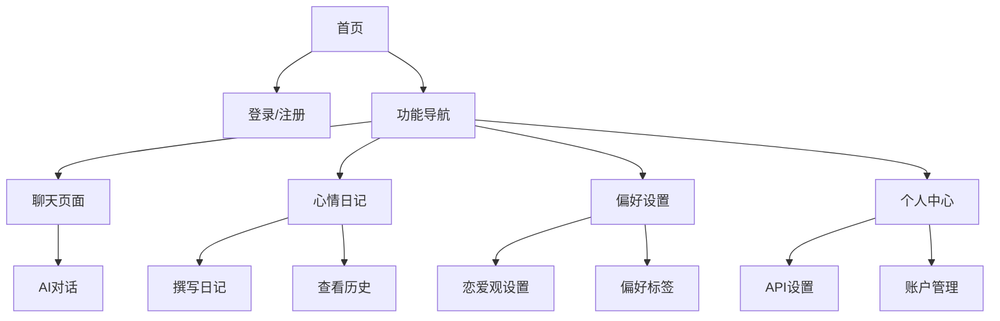

## 1. 产品概述

情感AI伴侣是一款基于人工智能的个人情感辅助应用，旨在为用户提供专业的恋爱建议、关系指导和情感陪伴。通过自然语言交互，帮助用户更好地理解情感问题、处理恋爱困惑、记录心情变化。

- **核心目标**：帮助单身人士找到恋爱方向，帮助恋爱中的人提升关系质量
- **目标用户**：18-40岁需要情感咨询和恋爱指导的单身或恋爱中人士
- **产品价值**：提供7x24小时的AI情感陪伴，弥补传统情感咨询的时间和成本障碍

## 2. 核心功能

### 2.1 用户角色

| 角色 | 注册方式 | 核心权限 |
|------|----------|----------|
| 普通用户 | 邮箱注册 | 使用AI聊天、查看心情日记、管理偏好设置 |
| 会员用户 | 付费升级 | 无限聊天次数、高级情感分析报告、优先客服支持 |

### 2.2 功能模块

本产品包含以下核心页面：

1. **首页**：应用入口，展示功能导航、快速开始聊天入口、用户状态概览
2. **聊天页面**：AI情感助手对话界面，支持文字聊天、恋爱建议、关系指导
3. **心情日记页面**：记录每日心情、情感变化，支持日历视图和时间线展示
4. **偏好设置页面**：管理用户情感偏好、恋爱观、期望关系类型
5. **个人中心页面**：账户管理、会员状态、API Key设置

### 2.3 页面详情

| 页面名称 | 模块名称 | 功能描述 |
|----------|----------|----------|
| 首页 | 欢迎区 | 展示应用名称、slogan，区分登录/未登录状态 |
| 首页 | 功能导航区 | 提供聊天、心情日记、偏好设置等主要功能入口 |
| 首页 | 状态概览区 | 显示会员状态、今日对话次数、连续登录天数 |
| 聊天页面 | 对话区 | 显示AI助手和用户的对话历史，支持滚动查看 |
| 聊天页面 | 输入区 | 支持文字输入、发送按钮、清除对话按钮 |
| 聊天页面 | 会话管理区 | 创建新对话、选择历史对话、删除会话 |
| 心情日记 | 日历视图 | 月历形式展示心情标记，点击日期查看详情 |
| 心情日记 | 撰写区 | 记录今日心情、选择心情标签(开心/难过/焦虑/期待等)、写日记内容 |
| 心情日记 | 时间线 | 按时间顺序展示历史日记，支持搜索和筛选 |
| 偏好设置 | 恋爱观设置 | 设置期望的恋爱模式(单身/暗恋/恋爱中/已婚) |
| 偏好设置 | 偏好标签 | 选择感兴趣的话题(约会技巧、沟通技巧、情绪管理等) |
| 偏好设置 | AI性格设置 | 选择AI助手的回复风格(温柔型/理性型/幽默型) |
| 个人中心 | 账户信息 | 显示用户名、头像、会员到期时间 |
| 个人中心 | API设置 | 输入和管理OpenAI API Key，展示使用量统计 |
| 个人中心 | 设置选项 | 主题切换(浅色/深色)、通知设置、退出登录 |

### 2.4 多模态学习模块（核心功能）

本模块允许用户上传学习资料，AI通过分析这些内容来定制个性化的回复风格。

#### 2.4.1 支持的内容类型

| 内容类型 | 处理方式 | 用途 |
|----------|----------|------|
| 视频（课程、案例） | 抽帧 → LLM总结 → embedding | 学习恋爱技巧、案例分析 |
| 语音（聊天录音） | Whisper转写 → 文本embedding | 了解用户沟通风格 |
| 文章（情感导师文本） | 清洗 → embedding | 吸收专业情感知识 |
| 图片（情感聊天截图） | OCR识别 → embedding | 分析真实对话场景 |

#### 2.4.2 推荐的AI模型

| 功能 | 推荐模型 | 备选模型 |
|------|----------|----------|
| 视频理解 | Google Gemini 1.5 Pro | OpenAI GPT-4o |
| 多模态推理 | OpenAI GPT-4o / GPT-5 | Claude 3.5 Sonnet |
| 开源方案 | Alibaba Qwen2-VL | LLaVA |

#### 2.4.3 技术架构

```
上传内容
    ↓
内容类型识别
    ↓
┌─────────────────────────────────────────┐
│  视频 → 抽帧 → LLM总结 → 向量嵌入       │
│  语音 → Whisper → 文本 → 向量嵌入      │
│  文本 → 清洗 → 向量嵌入                │
│  图片 → OCR → 文本 → 向量嵌入          │
└─────────────────────────────────────────┘
    ↓
向量数据库（Milvus / Pinecone / Qdrant）
    ↓
RAG检索增强生成
    ↓
AI基于学习内容生成个性化回复
```

#### 2.4.4 功能页面

| 页面名称 | 功能描述 |
|----------|----------|
| 学习中心 | 展示已上传的资料库，支持分类查看 |
| 上传资料 | 支持拖拽上传视频/语音/文章/图片，显示上传进度 |
| 资料库管理 | 查看、删除已上传的资料，显示处理状态 |
| 人格定制 | 选择不同风格的人格模板（基于学习内容生成） |
| 测试对话 | 用定制的人格进行测试对话 |

#### 2.4.5 数据处理规则

- **视频处理**：每分钟提取1帧关键帧，发送给LLM总结，提取关键信息
- **语音处理**：使用Whisper转写为文本，保留时间戳信息
- **文本处理**：清洗HTML标签、特殊字符，保留核心内容
- **隐私保护**：所有原始文件本地处理，不上传到服务器，仅存储向量

## 3. 核心流程

### 用户流程

**新用户首次使用流程：**
1. 用户打开应用 → 进入首页(未登录状态)
2. 用户注册/登录账户
3. 首次进入引导设置恋爱状态和偏好标签
4. 设置OpenAI API Key(可选，后续可补全)
5. 开始使用AI聊天功能

**日常使用流程：**
1. 用户打开应用 → 进入首页(已登录状态)
2. 从功能导航选择需要的功能(聊天/日记/设置)
3. 使用对应功能
4. 返回首页或退出

**AI聊天流程：**
1. 用户进入聊天页面
2. 输入想咨询的情感问题
3. AI根据用户偏好和上下文给出回复
4. 用户可继续追问或开启新话题
5. 对话自动保存到历史记录



## 4. 用户界面设计

### 4.1 设计风格

- **主色调**：#FF6B9D(温暖粉红) - 代表爱情和温暖
- **辅助色**：#8B5CF6(浪漫紫) - 代表神秘和优雅
- **背景色**：#FFFBF5(奶油白) - 柔和护眼
- **文字色**：#374151(深灰)、#6B7280(中灰)
- **按钮风格**：圆角按钮(8px)，主要按钮使用渐变色(粉红到紫)
- **字体**：使用系统默认字体(无衬线体)，标题18-24px，正文14-16px
- **布局风格**：卡片式布局，顶部导航栏，底部标签切换
- **图标风格**：简洁线条图标，24x24px
- **动画效果**：按钮悬停放大1.05倍，页面切换淡入淡出

### 4.2 页面设计概述

| 页面名称 | 模块名称 | UI元素 |
|----------|----------|--------|
| 首页 | 欢迎区 | 大标题居中，副标题说明功能，卡片式功能入口 |
| 首页 | 功能导航 | 3个主功能按钮(聊天/日记/设置)，图标+文字组合 |
| 首页 | 状态概览 | 横向卡片布局，显示关键数据指标 |
| 聊天页面 | 对话区 | 左右分布气泡(用户右对齐，AI左对齐)，带头像和时间戳 |
| 聊天页面 | 输入区 | 底部固定输入框，发送按钮带颜色反馈 |
| 心情日记 | 日历视图 | 月历网格，日期带心情颜色标记 |
| 心情日记 | 撰写区 | 心情选择按钮组+大文本输入框+保存按钮 |
| 偏好设置 | 表单项 | 标签选择器、开关组件、下拉选择框 |
| 个人中心 | 账户卡片 | 头像+用户名+会员标识，列表式功能项 |

### 4.3 响应式设计

- **移动端优先**：主要面向移动设备设计，适配375px-428px宽度
- **平板适配**：使用响应式网格，768px以上双栏布局
- **桌面端适配**：最大内容宽度600px，居中显示
- **触摸优化**：所有可点击元素最小44x44px touch target

## 5. 非功能需求

### 5.1 性能需求

- 页面首次加载时间 < 3秒
- AI回复响应时间 < 10秒(取决于API Key的响应速度)
- 应用内页面切换 < 300ms

### 5.2 安全性需求

- 用户密码使用加密存储
- API Key仅保存在用户本地，不上传服务器
- 对话数据本地存储，保护用户隐私

### 5.3 兼容性需求

- 支持 iOS 12+ 和 Android 8+ 系统
- 支持主流浏览器(Chrome、Safari、Edge、Firefox)
- 需要网络连接才能使用AI对话功能

### 5.4 可用性需求

- 新用户5分钟内完成首次对话
- 所有核心功能可通过3次点击内完成操作
- 提供清晰的功能引导和操作提示
