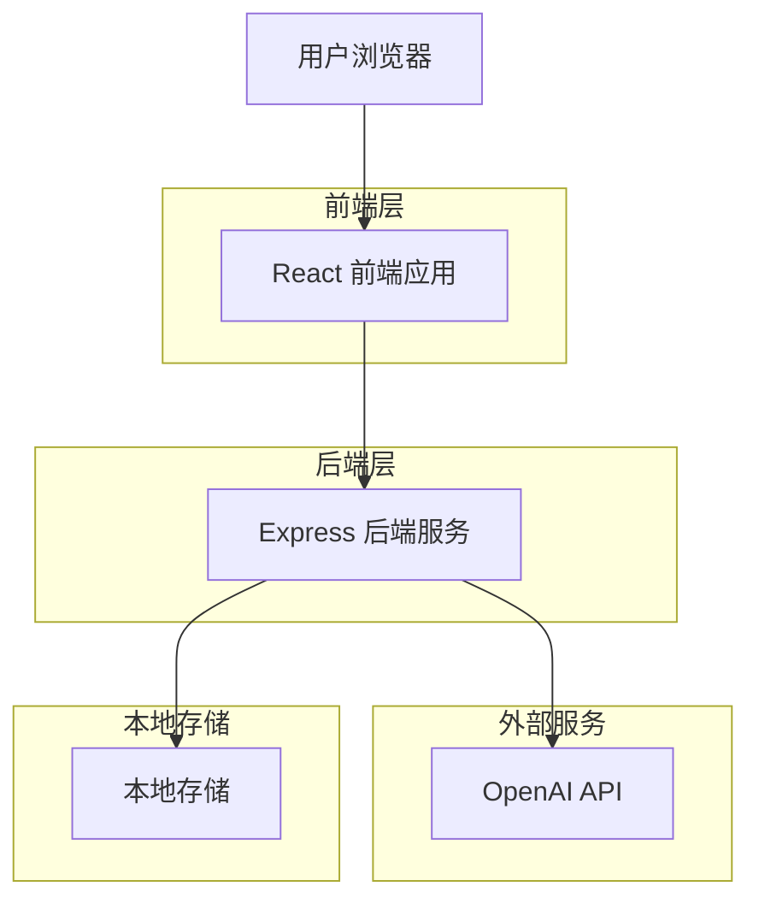
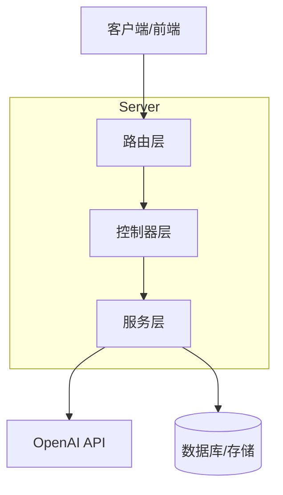
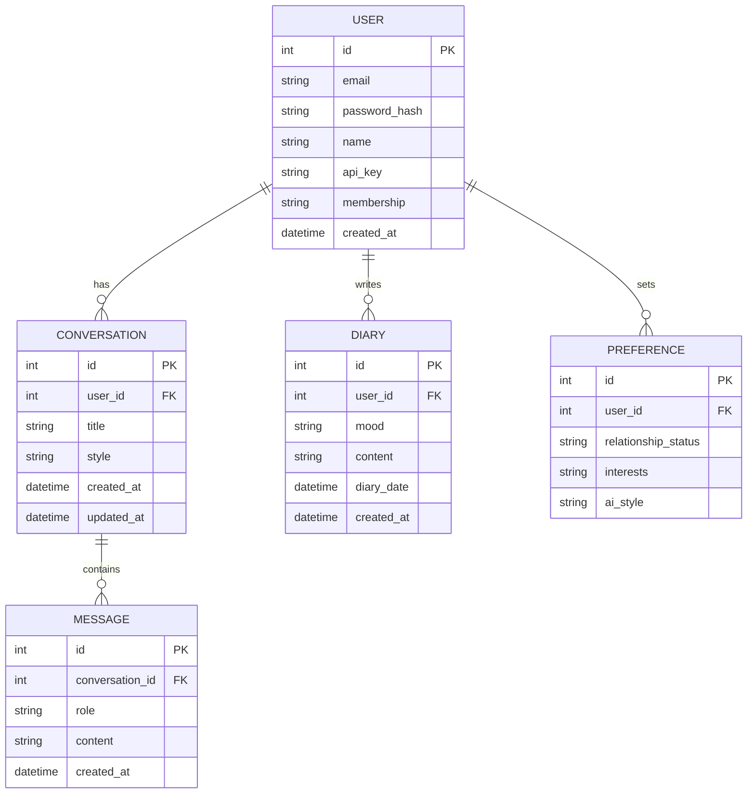

## 1. 架构设计



## 2. 技术描述

- **前端**：React@18 + TypeScript + Vite + Tailwind CSS@3
- **后端**：Express@4 + cors + dotenv
- **AI服务**：OpenAI API (用户自行提供API Key)
- **存储**：浏览器 LocalStorage (对话历史、心日记、用户偏好)
- **多模态处理**：ffmpeg (视频) + openai-whisper (语音) + Tesseract (OCR)
- **向量数据库**：Qdrant (开源本地部署) / Pinecone (云服务)
- **Embedding**：OpenAI text-embedding-3-small / 开源方案 (BGE-M3)

## 3. 路由定义

| 路由 | 用途 |
|------|------|
| / | 首页，展示功能导航和用户状态 |
| /chat | 聊天页面，AI情感助手对话界面 |
| /chat/:id | 指定会话的聊天页面 |
| /diary | 心情日记列表和日历视图 |
| /diary/new | 撰写新日记页面 |
| /diary/:id | 查看/编辑指定日记 |
| /learn | 学习中心，资料库管理 |
| /learn/upload | 上传资料页面 |
| /learn/persona | 人格定制页面 |
| /settings | 偏好设置页面 |
| /profile | 个人中心，账户管理和API设置 |
| /login | 登录页面 |
| /register | 注册页面 |

## 4. API 定义

### 4.1 核心 API

**AI 对话接口**
```
POST /api/chat
```

Request:
| 参数名 | 类型 | 必填 | 描述 |
|--------|------|------|------|
| message | string | true | 用户发送的消息 |
| conversationId | string | false | 会话ID，新会话时为空 |
| style | string | false | AI回复风格(gentle/rational/humorous) |

Response:
| 参数名 | 类型 | 描述 |
|--------|------|------|
| response | string | AI的回复内容 |
| conversationId | string | 会话ID |

Example
```json
{
  "message": "我该怎么和暗恋的人表白？",
  "conversationId": "",
  "style": "gentle"
}
```

### 4.2 用户认证

**用户注册**
```
POST /api/auth/register
```

Request:
| 参数名 | 类型 | 必填 | 描述 |
|--------|------|------|------|
| email | string | true | 用户邮箱 |
| password | string | true | 密码 |
| name | string | true | 用户名 |

**用户登录**
```
POST /api/auth/login
```

Request:
| 参数名 | 类型 | 必填 | 描述 |
|--------|------|------|------|
| email | string | true | 用户邮箱 |
| password | string | true | 密码 |

### 4.3 多模态学习接口

**上传学习资料**
```
POST /api/learn/upload
```
Content-Type: multipart/form-data

| 参数名 | 类型 | 必填 | 描述 |
|--------|------|------|------|
| file | File | true | 视频/音频/图片/文档文件 |
| type | string | true | 文件类型(video/audio/image/text) |
| title | string | false | 资料标题 |
| description | string | false | 资料描述 |

**获取资料库列表**
```
GET /api/learn/materials
```

**删除学习资料**
```
DELETE /api/learn/materials/:id
```

**创建人格模板**
```
POST /api/learn/persona
```

Request:
| 参数名 | 类型 | 必填 | 描述 |
|--------|------|------|------|
| name | string | true | 人格名称 |
| description | string | true | 人格描述 |
| style | string | true | 风格类型 |
| materialIds | number[] | false | 引用的资料ID |

**获取人格列表**
```
GET /api/learn/personas
```

**RAG增强对话**
```
POST /api/chat/rag
```

| 参数名 | 类型 | 必填 | 描述 |
|--------|------|------|------|
| message | string | true | 用户消息 |
| personaId | number | false | 使用的人格ID |
| conversationId | string | false | 会话ID |

## 5. 服务端架构图



## 6. 数据模型

### 6.1 数据模型定义



### 6.2 数据定义语言

用户表 (users)
```
CREATE TABLE users (
    id SERIAL PRIMARY KEY,
    email VARCHAR(255) UNIQUE NOT NULL,
    password_hash VARCHAR(255) NOT NULL,
    name VARCHAR(100) NOT NULL,
    api_key VARCHAR(255),
    membership VARCHAR(20) DEFAULT 'free' CHECK (membership IN ('free', 'premium')),
    created_at TIMESTAMP WITH TIME ZONE DEFAULT NOW()
);
```

会话表 (conversations)
```
CREATE TABLE conversations (
    id SERIAL PRIMARY KEY,
    user_id INTEGER REFERENCES users(id),
    title VARCHAR(255),
    style VARCHAR(20) DEFAULT 'gentle',
    created_at TIMESTAMP WITH TIME ZONE DEFAULT NOW(),
    updated_at TIMESTAMP WITH TIME ZONE DEFAULT NOW()
);
```

消息表 (messages)
```
CREATE TABLE messages (
    id SERIAL PRIMARY KEY,
    conversation_id INTEGER REFERENCES conversations(id),
    role VARCHAR(20) NOT NULL CHECK (role IN ('user', 'assistant')),
    content TEXT NOT NULL,
    created_at TIMESTAMP WITH TIME ZONE DEFAULT NOW()
);
```

日记表 (diaries)
```
CREATE TABLE diaries (
    id SERIAL PRIMARY KEY,
    user_id INTEGER REFERENCES users(id),
    mood VARCHAR(50),
    content TEXT,
    diary_date DATE,
    created_at TIMESTAMP WITH TIME ZONE DEFAULT NOW()
);
```

偏好设置表 (preferences)
```
CREATE TABLE preferences (
    id SERIAL PRIMARY KEY,
    user_id INTEGER REFERENCES users(id) UNIQUE,
    relationship_status VARCHAR(50),
    interests TEXT,
    ai_style VARCHAR(20) DEFAULT 'gentle'
);
```

创建索引
```
CREATE INDEX idx_conversations_user_id ON conversations(user_id);
CREATE INDEX idx_messages_conversation_id ON messages(conversation_id);
CREATE INDEX idx_diaries_user_id ON diaries(user_id);
CREATE INDEX idx_diaries_date ON diaries(diary_date DESC);
```

### 6.3 多模态学习数据表

学习资料表 (learning_materials)
```
CREATE TABLE learning_materials (
    id SERIAL PRIMARY KEY,
    user_id INTEGER REFERENCES users(id),
    title VARCHAR(255),
    description TEXT,
    type VARCHAR(20) NOT NULL CHECK (type IN ('video', 'audio', 'image', 'text')),
    file_path VARCHAR(500),
    file_size BIGINT,
    status VARCHAR(20) DEFAULT 'pending' CHECK (status IN ('pending', 'processing', 'completed', 'failed')),
    vector_ids TEXT,
    summary TEXT,
    created_at TIMESTAMP WITH TIME ZONE DEFAULT NOW()
);
```

人格模板表 (personas)
```
CREATE TABLE personas (
    id SERIAL PRIMARY KEY,
    user_id INTEGER REFERENCES users(id),
    name VARCHAR(100) NOT NULL,
    description TEXT,
    style VARCHAR(50),
    system_prompt TEXT,
    material_ids TEXT,
    is_active BOOLEAN DEFAULT false,
    created_at TIMESTAMP WITH TIME ZONE DEFAULT NOW()
);
```

创建索引
```
CREATE INDEX idx_materials_user_id ON learning_materials(user_id);
CREATE INDEX idx_materials_status ON learning_materials(status);
CREATE INDEX idx_personas_user_id ON personas(user_id);
CREATE INDEX idx_personas_active ON personas(is_active);
```
